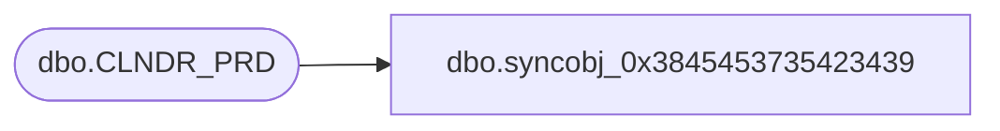

# dbo.syncobj_0x3845453735423439

**Database:** auditworks  
**Server:** bedrockdb01  

## Architecture Diagram



## Table Dependencies

| Referenced Table |
|---|
| dbo.CLNDR_PRD |

## View Code

```sql
create view [dbo].[syncobj_0x3845453735423439]as select  [CLNDR_PRD_ID],[CLNDR_PRD_NUM],[CLNDR_PRD_NAME],[STRT_DATE_TIME],[END_DATE_TIME],[CLNDR_ID],[CLNDR_LVL_TYPE_ID],[ROOT_TMPLT_ID]  from  [dbo].[CLNDR_PRD]  where HAS_PERMS_BY_NAME('[dbo].[CLNDR_PRD]', 'OBJECT', 'SELECT')= 1
```

