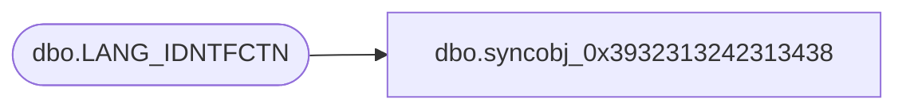

# dbo.syncobj_0x3932313242313438

**Database:** auditworks  
**Server:** bedrockdb01  

## Architecture Diagram



## Table Dependencies

| Referenced Table |
|---|
| dbo.LANG_IDNTFCTN |

## View Code

```sql
create view [dbo].[syncobj_0x3932313242313438]as select  [LANG_ID],[ENGLSH_DESC],[DSPLY_DESC],[ACTV],[CLMN_PSTN]  from  [dbo].[LANG_IDNTFCTN]  where HAS_PERMS_BY_NAME('[dbo].[LANG_IDNTFCTN]', 'OBJECT', 'SELECT')= 1
```

