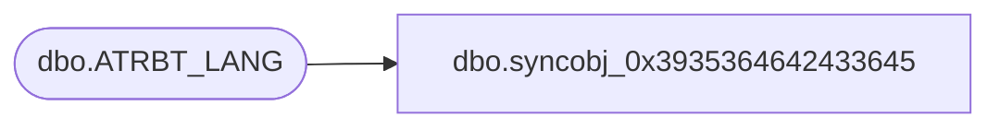

# dbo.syncobj_0x3935364642433645

**Database:** auditworks  
**Server:** bedrockdb01  

## Architecture Diagram



## Table Dependencies

| Referenced Table |
|---|
| dbo.ATRBT_LANG |

## View Code

```sql
create view [dbo].[syncobj_0x3935364642433645]as select  [ATRBT_CODE],[LANG_ID],[ATRBT_DESC],[ATRBT_TYPE]  from  [dbo].[ATRBT_LANG]  where HAS_PERMS_BY_NAME('[dbo].[ATRBT_LANG]', 'OBJECT', 'SELECT')= 1
```

