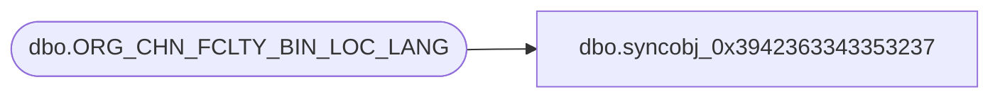

# dbo.syncobj_0x3942363343353237

**Database:** auditworks  
**Server:** bedrockdb01  

## Architecture Diagram



## Table Dependencies

| Referenced Table |
|---|
| dbo.ORG_CHN_FCLTY_BIN_LOC_LANG |

## View Code

```sql
create view [dbo].[syncobj_0x3942363343353237]as select  [BIN_LOC_ID],[LANG_ID],[BIN_LOC_DESC]  from  [dbo].[ORG_CHN_FCLTY_BIN_LOC_LANG]  where HAS_PERMS_BY_NAME('[dbo].[ORG_CHN_FCLTY_BIN_LOC_LANG]', 'OBJECT', 'SELECT')= 1
```

