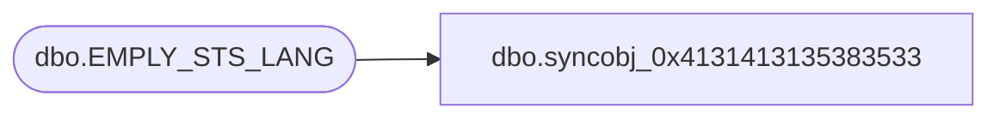

# dbo.syncobj_0x4131413135383533

**Database:** auditworks  
**Server:** bedrockdb01  

## Architecture Diagram



## Table Dependencies

| Referenced Table |
|---|
| dbo.EMPLY_STS_LANG |

## View Code

```sql
create view [dbo].[syncobj_0x4131413135383533]as select  [EMPLY_STS_CODE],[LANG_ID],[EMPLY_STS_DESC],[EMPLY_STS_SHRT_DESC]  from  [dbo].[EMPLY_STS_LANG]  where HAS_PERMS_BY_NAME('[dbo].[EMPLY_STS_LANG]', 'OBJECT', 'SELECT')= 1
```

