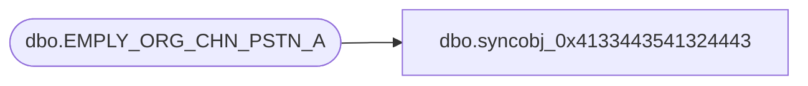

# dbo.syncobj_0x4133443541324443

**Database:** auditworks  
**Server:** bedrockdb01  

## Architecture Diagram



## Table Dependencies

| Referenced Table |
|---|
| dbo.EMPLY_ORG_CHN_PSTN_A |

## View Code

```sql
create view [dbo].[syncobj_0x4133443541324443]as select  [EMPLY_NUM],[ORG_CHN_NUM],[PSTN_CODE],[EFCTV_DATE],[EXPRTN_DATE],[EMPLY_SHRT_NUM],[ACNTBLTY],[PRMRY_LOC_ID],[WORK_TLPHN_NUM],[WORK_FAX_NUM],[WORK_MBL_NUM],[WORK_EML_ADRS],[PRMRY_LOC_A],[EMPLY_ORG_CHN_PSTN_A_ID],[FDN_CSTMZTN_DATA]  from  [dbo].[EMPLY_ORG_CHN_PSTN_A]  where HAS_PERMS_BY_NAME('[dbo].[EMPLY_ORG_CHN_PSTN_A]', 'OBJECT', 'SELECT')= 1
```

