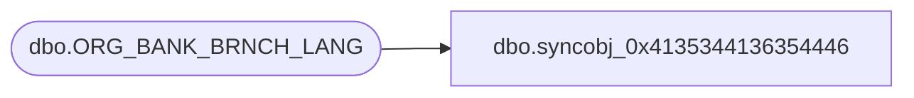

# dbo.syncobj_0x4135344136354446

**Database:** auditworks  
**Server:** bedrockdb01  

## Architecture Diagram



## Table Dependencies

| Referenced Table |
|---|
| dbo.ORG_BANK_BRNCH_LANG |

## View Code

```sql
create view [dbo].[syncobj_0x4135344136354446]as select  [BANK_BRNCH_ID],[LANG_ID],[BANK_BRNCH_NAME],[BANK_BRNCH_SHRT_NAME]  from  [dbo].[ORG_BANK_BRNCH_LANG]  where HAS_PERMS_BY_NAME('[dbo].[ORG_BANK_BRNCH_LANG]', 'OBJECT', 'SELECT')= 1
```

