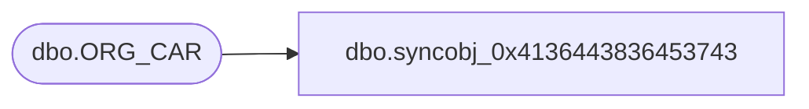

# dbo.syncobj_0x4136443836453743

**Database:** auditworks  
**Server:** bedrockdb01  

## Architecture Diagram



## Table Dependencies

| Referenced Table |
|---|
| dbo.ORG_CAR |

## View Code

```sql
create view [dbo].[syncobj_0x4136443836453743]as select  [CAR_ID],[CAR_NAME],[ACTV],[DFLT_ADRS_SEQ]  from  [dbo].[ORG_CAR]  where HAS_PERMS_BY_NAME('[dbo].[ORG_CAR]', 'OBJECT', 'SELECT')= 1
```

