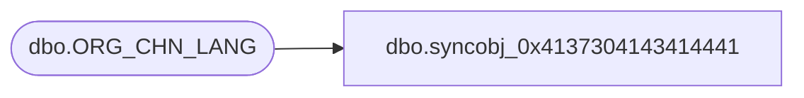

# dbo.syncobj_0x4137304143414441

**Database:** auditworks  
**Server:** bedrockdb01  

## Architecture Diagram



## Table Dependencies

| Referenced Table |
|---|
| dbo.ORG_CHN_LANG |

## View Code

```sql
create view [dbo].[syncobj_0x4137304143414441]as select  [ORG_CHN_NUM],[LANG_ID],[ORG_CHN_NAME],[ORG_CHN_SHRT_NAME],[STLMNT_BLNG_NAME],[TMPLT_DESC],[CLS_RSN]  from  [dbo].[ORG_CHN_LANG]  where HAS_PERMS_BY_NAME('[dbo].[ORG_CHN_LANG]', 'OBJECT', 'SELECT')= 1
```

