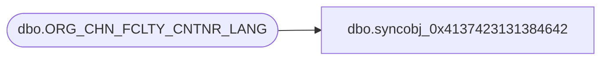

# dbo.syncobj_0x4137423131384642

**Database:** auditworks  
**Server:** bedrockdb01  

## Architecture Diagram



## Table Dependencies

| Referenced Table |
|---|
| dbo.ORG_CHN_FCLTY_CNTNR_LANG |

## View Code

```sql
create view [dbo].[syncobj_0x4137423131384642]as select  [CNTNR_ID],[LANG_ID],[CNTNR_DESC],[CNTNR_SHRT_DESC]  from  [dbo].[ORG_CHN_FCLTY_CNTNR_LANG]  where HAS_PERMS_BY_NAME('[dbo].[ORG_CHN_FCLTY_CNTNR_LANG]', 'OBJECT', 'SELECT')= 1
```

