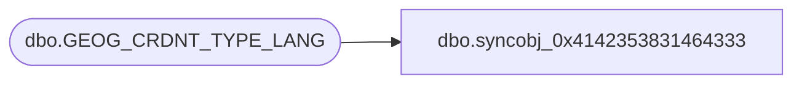

# dbo.syncobj_0x4142353831464333

**Database:** auditworks  
**Server:** bedrockdb01  

## Architecture Diagram



## Table Dependencies

| Referenced Table |
|---|
| dbo.GEOG_CRDNT_TYPE_LANG |

## View Code

```sql
create view [dbo].[syncobj_0x4142353831464333]as select  [LANG_ID],[CRDNT_TYPE_CODE],[CRDNT_TYPE_DESC],[CRDNT_TYPE_SHRT_DESC]  from  [dbo].[GEOG_CRDNT_TYPE_LANG]  where HAS_PERMS_BY_NAME('[dbo].[GEOG_CRDNT_TYPE_LANG]', 'OBJECT', 'SELECT')= 1
```

