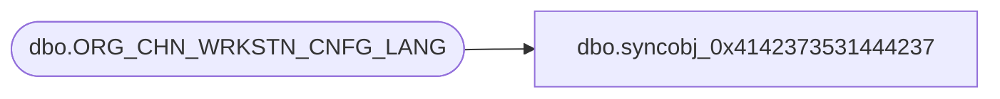

# dbo.syncobj_0x4142373531444237

**Database:** auditworks  
**Server:** bedrockdb01  

## Architecture Diagram



## Table Dependencies

| Referenced Table |
|---|
| dbo.ORG_CHN_WRKSTN_CNFG_LANG |

## View Code

```sql
create view [dbo].[syncobj_0x4142373531444237]as select  [WRKSTN_CNFG_CODE],[LANG_ID],[WRKSTN_CNFG_DESC],[WRKSTN_CNFG_SHRT_DESC]  from  [dbo].[ORG_CHN_WRKSTN_CNFG_LANG]  where HAS_PERMS_BY_NAME('[dbo].[ORG_CHN_WRKSTN_CNFG_LANG]', 'OBJECT', 'SELECT')= 1
```

