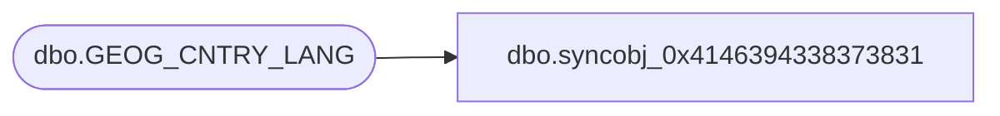

# dbo.syncobj_0x4146394338373831

**Database:** auditworks  
**Server:** bedrockdb01  

## Architecture Diagram



## Table Dependencies

| Referenced Table |
|---|
| dbo.GEOG_CNTRY_LANG |

## View Code

```sql
create view [dbo].[syncobj_0x4146394338373831]as select  [LANG_ID],[CNTRY_CODE_ISO3],[CNTRY_DESC],[CNTRY_SHRT_DESC]  from  [dbo].[GEOG_CNTRY_LANG]  where HAS_PERMS_BY_NAME('[dbo].[GEOG_CNTRY_LANG]', 'OBJECT', 'SELECT')= 1
```

