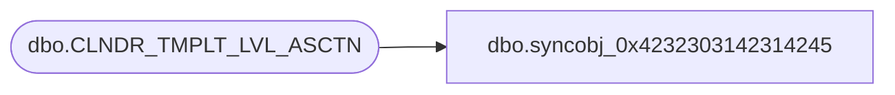

# dbo.syncobj_0x4232303142314245

**Database:** auditworks  
**Server:** bedrockdb01  

## Architecture Diagram



## Table Dependencies

| Referenced Table |
|---|
| dbo.CLNDR_TMPLT_LVL_ASCTN |

## View Code

```sql
create view [dbo].[syncobj_0x4232303142314245]as select  [CLNDR_TMPLT_ID],[PRNT_CLNDR_LVL_TYPE_ID],[CHLD_CLNDR_LVL_TYPE_ID],[CHLD_CNT],[CHLD_CNT_ALGRTHM_ID]  from  [dbo].[CLNDR_TMPLT_LVL_ASCTN]  where HAS_PERMS_BY_NAME('[dbo].[CLNDR_TMPLT_LVL_ASCTN]', 'OBJECT', 'SELECT')= 1
```

