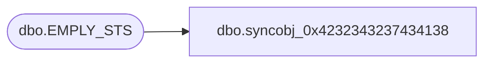

# dbo.syncobj_0x4232343237434138

**Database:** auditworks  
**Server:** bedrockdb01  

## Architecture Diagram



## Table Dependencies

| Referenced Table |
|---|
| dbo.EMPLY_STS |

## View Code

```sql
create view [dbo].[syncobj_0x4232343237434138]as select  [EMPLY_STS_CODE],[EMPLY_STS_DESC],[EMPLY_STS_SHRT_DESC],[SYS_CODE]  from  [dbo].[EMPLY_STS]  where HAS_PERMS_BY_NAME('[dbo].[EMPLY_STS]', 'OBJECT', 'SELECT')= 1
```

