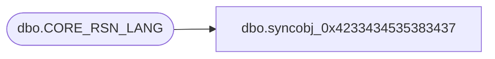

# dbo.syncobj_0x4233434535383437

**Database:** auditworks  
**Server:** bedrockdb01  

## Architecture Diagram



## Table Dependencies

| Referenced Table |
|---|
| dbo.CORE_RSN_LANG |

## View Code

```sql
create view [dbo].[syncobj_0x4233434535383437]as select  [LANG_ID],[RSN_ID],[RSN_DESC],[RSN_SHRT_DESC]  from  [dbo].[CORE_RSN_LANG]  where HAS_PERMS_BY_NAME('[dbo].[CORE_RSN_LANG]', 'OBJECT', 'SELECT')= 1
```

