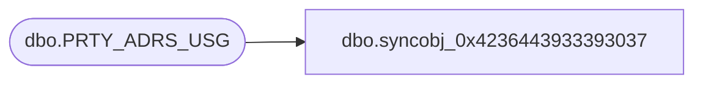

# dbo.syncobj_0x4236443933393037

**Database:** auditworks  
**Server:** bedrockdb01  

## Architecture Diagram



## Table Dependencies

| Referenced Table |
|---|
| dbo.PRTY_ADRS_USG |

## View Code

```sql
create view [dbo].[syncobj_0x4236443933393037]as select  [PRTY_ID],[PRTY_ADRS_SEQ],[PRTY_ADRS_DESC],[ADRS_FNCTN_CODE],[CNTCT_PREF_ID]  from  [dbo].[PRTY_ADRS_USG]  where HAS_PERMS_BY_NAME('[dbo].[PRTY_ADRS_USG]', 'OBJECT', 'SELECT')= 1
```

