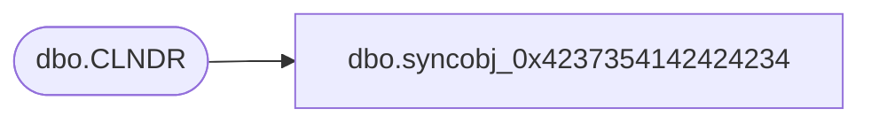

# dbo.syncobj_0x4237354142424234

**Database:** auditworks  
**Server:** bedrockdb01  

## Architecture Diagram



## Table Dependencies

| Referenced Table |
|---|
| dbo.CLNDR |

## View Code

```sql
create view [dbo].[syncobj_0x4237354142424234]as select  [CLNDR_ID],[CLNDR_DESC],[AVLBL_DATE],[CLNDR_TMPLT_ID],[ACTV]  from  [dbo].[CLNDR]  where HAS_PERMS_BY_NAME('[dbo].[CLNDR]', 'OBJECT', 'SELECT')= 1
```

