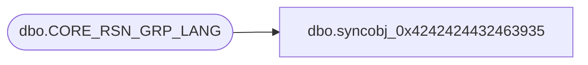

# dbo.syncobj_0x4242424432463935

**Database:** auditworks  
**Server:** bedrockdb01  

## Architecture Diagram



## Table Dependencies

| Referenced Table |
|---|
| dbo.CORE_RSN_GRP_LANG |

## View Code

```sql
create view [dbo].[syncobj_0x4242424432463935]as select  [LANG_ID],[RSN_GRP_ID],[RSN_GRP_DESC],[RSN_GRP_SHRT_DESC]  from  [dbo].[CORE_RSN_GRP_LANG]  where HAS_PERMS_BY_NAME('[dbo].[CORE_RSN_GRP_LANG]', 'OBJECT', 'SELECT')= 1
```

