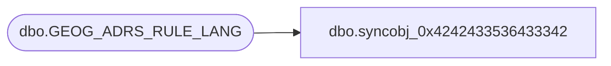

# dbo.syncobj_0x4242433536433342

**Database:** auditworks  
**Server:** bedrockdb01  

## Architecture Diagram



## Table Dependencies

| Referenced Table |
|---|
| dbo.GEOG_ADRS_RULE_LANG |

## View Code

```sql
create view [dbo].[syncobj_0x4242433536433342]as select  [LANG_ID],[ADRS_RULE_ID],[ADRS_RULE_DESC],[ADRS_LINE_1_DESC],[ADRS_LINE_2_DESC],[ADRS_LINE_3_DESC],[ADRS_LINE_4_DESC],[ADRS_CITY_DESC],[ADRS_POST_CODE_DESC],[ADRS_TRTRY_DESC]  from  [dbo].[GEOG_ADRS_RULE_LANG]  where HAS_PERMS_BY_NAME('[dbo].[GEOG_ADRS_RULE_LANG]', 'OBJECT', 'SELECT')= 1
```

