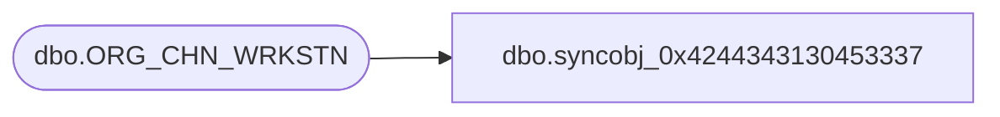

# dbo.syncobj_0x4244343130453337

**Database:** auditworks  
**Server:** bedrockdb01  

## Architecture Diagram



## Table Dependencies

| Referenced Table |
|---|
| dbo.ORG_CHN_WRKSTN |

## View Code

```sql
create view [dbo].[syncobj_0x4244343130453337]as select  [WRKSTN_ID],[WRKSTN_NUM],[TRMNL_MDL_NUM],[CMPTR_NAME],[DRWR_CNT],[MNFCTR_NAME],[IP_ADRS],[PLNG_IDNTFR],[PLNG_LINE_NUM],[TRNG_MODE],[ACTBLTY_TYPE],[BSNS_DAY_END_RNG_START_TIME],[BSNS_DAY_END_RNG_END_TIME],[ACTV],[LOC_ID],[ORG_CHN_NUM],[PRNT_WRKSTN_ID],[CMR_A],[FDN_CSTMZTN_DATA]  from  [dbo].[ORG_CHN_WRKSTN]  where HAS_PERMS_BY_NAME('[dbo].[ORG_CHN_WRKSTN]', 'OBJECT', 'SELECT')= 1
```

