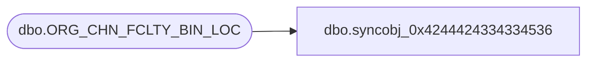

# dbo.syncobj_0x4244424334334536

**Database:** auditworks  
**Server:** bedrockdb01  

## Architecture Diagram



## Table Dependencies

| Referenced Table |
|---|
| dbo.ORG_CHN_FCLTY_BIN_LOC |

## View Code

```sql
create view [dbo].[syncobj_0x4244424334334536]as select  [BIN_LOC_ID],[LOC_ID],[BIN_LOC_CODE],[BIN_LOC_DESC],[STCK],[DPTH],[WDTH],[HGHT],[ACTV],[TRNVR],[TMPRY],[PICK_FRNT],[FTPRNT],[MSR_CODE]  from  [dbo].[ORG_CHN_FCLTY_BIN_LOC]  where HAS_PERMS_BY_NAME('[dbo].[ORG_CHN_FCLTY_BIN_LOC]', 'OBJECT', 'SELECT')= 1
```

