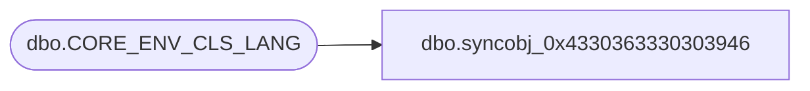

# dbo.syncobj_0x4330363330303946

**Database:** auditworks  
**Server:** bedrockdb01  

## Architecture Diagram



## Table Dependencies

| Referenced Table |
|---|
| dbo.CORE_ENV_CLS_LANG |

## View Code

```sql
create view [dbo].[syncobj_0x4330363330303946]as select  [ENV_CLS_CODE],[LANG_ID],[ENV_CLS_DESC],[ENV_CLS_SHRT_DESC]  from  [dbo].[CORE_ENV_CLS_LANG]  where HAS_PERMS_BY_NAME('[dbo].[CORE_ENV_CLS_LANG]', 'OBJECT', 'SELECT')= 1
```

