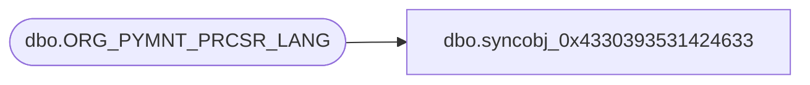

# dbo.syncobj_0x4330393531424633

**Database:** auditworks  
**Server:** bedrockdb01  

## Architecture Diagram



## Table Dependencies

| Referenced Table |
|---|
| dbo.ORG_PYMNT_PRCSR_LANG |

## View Code

```sql
create view [dbo].[syncobj_0x4330393531424633]as select  [PYMNT_PRCSR_CODE],[LANG_ID],[PYMNT_PRCSR_NAME],[PYMNT_PRCSR_SHRT_NAME]  from  [dbo].[ORG_PYMNT_PRCSR_LANG]  where HAS_PERMS_BY_NAME('[dbo].[ORG_PYMNT_PRCSR_LANG]', 'OBJECT', 'SELECT')= 1
```

