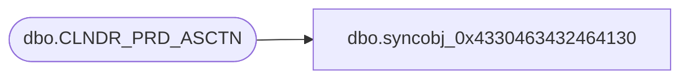

# dbo.syncobj_0x4330463432464130

**Database:** auditworks  
**Server:** bedrockdb01  

## Architecture Diagram



## Table Dependencies

| Referenced Table |
|---|
| dbo.CLNDR_PRD_ASCTN |

## View Code

```sql
create view [dbo].[syncobj_0x4330463432464130]as select  [PRNT_CLNDR_PRD_ID],[CHLD_CLNDR_PRD_ID],[CHLD_LVL_TYPE_ID],[CLNDR_ID]  from  [dbo].[CLNDR_PRD_ASCTN]  where HAS_PERMS_BY_NAME('[dbo].[CLNDR_PRD_ASCTN]', 'OBJECT', 'SELECT')= 1
```

