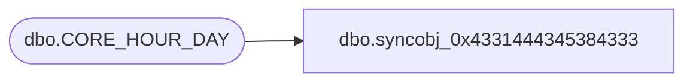

# dbo.syncobj_0x4331444345384333

**Database:** auditworks  
**Server:** bedrockdb01  

## Architecture Diagram



## Table Dependencies

| Referenced Table |
|---|
| dbo.CORE_HOUR_DAY |

## View Code

```sql
create view [dbo].[syncobj_0x4331444345384333]as select  [HOUR_ID],[DAY_NUM],[START_TIME],[END_TIME]  from  [dbo].[CORE_HOUR_DAY]  where HAS_PERMS_BY_NAME('[dbo].[CORE_HOUR_DAY]', 'OBJECT', 'SELECT')= 1
```

