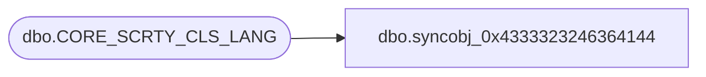

# dbo.syncobj_0x4333323246364144

**Database:** auditworks  
**Server:** bedrockdb01  

## Architecture Diagram



## Table Dependencies

| Referenced Table |
|---|
| dbo.CORE_SCRTY_CLS_LANG |

## View Code

```sql
create view [dbo].[syncobj_0x4333323246364144]as select  [SCRTY_CLS_CODE],[LANG_ID],[SCRTY_CLS_DESC],[SCRTY_CLS_SHRT_DESC]  from  [dbo].[CORE_SCRTY_CLS_LANG]  where HAS_PERMS_BY_NAME('[dbo].[CORE_SCRTY_CLS_LANG]', 'OBJECT', 'SELECT')= 1
```

