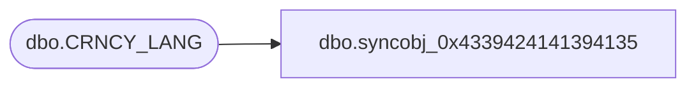

# dbo.syncobj_0x4339424141394135

**Database:** auditworks  
**Server:** bedrockdb01  

## Architecture Diagram



## Table Dependencies

| Referenced Table |
|---|
| dbo.CRNCY_LANG |

## View Code

```sql
create view [dbo].[syncobj_0x4339424141394135]as select  [CRNCY_CODE],[LANG_ID],[CRNCY_DESC],[CRNCY_SHRT_DESC]  from  [dbo].[CRNCY_LANG]  where HAS_PERMS_BY_NAME('[dbo].[CRNCY_LANG]', 'OBJECT', 'SELECT')= 1
```

