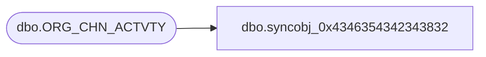

# dbo.syncobj_0x4346354342343832

**Database:** auditworks  
**Server:** bedrockdb01  

## Architecture Diagram



## Table Dependencies

| Referenced Table |
|---|
| dbo.ORG_CHN_ACTVTY |

## View Code

```sql
create view [dbo].[syncobj_0x4346354342343832]as select  [ACTVTY_CODE],[ACTVTY_DESC],[ACTVTY_SHRT_DESC],[SCRTY_CNFG],[ASGN_SLS_GOAL],[APRVL_ACTVTY_CODE],[SYS_CODE],[ACTV]  from  [dbo].[ORG_CHN_ACTVTY]  where HAS_PERMS_BY_NAME('[dbo].[ORG_CHN_ACTVTY]', 'OBJECT', 'SELECT')= 1
```

