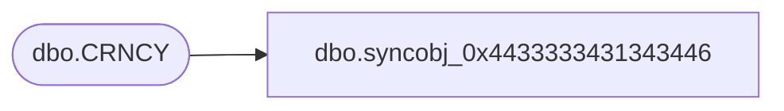

# dbo.syncobj_0x4433333431343446

**Database:** auditworks  
**Server:** bedrockdb01  

## Architecture Diagram



## Table Dependencies

| Referenced Table |
|---|
| dbo.CRNCY |

## View Code

```sql
create view [dbo].[syncobj_0x4433333431343446]as select  [CRNCY_ID],[CRNCY_CODE],[CRNCY_DESC],[CRNCY_SHRT_DESC],[ACTV],[RSRC_ID],[DSPL_MASK],[CRNCY_SMBL]  from  [dbo].[CRNCY]  where HAS_PERMS_BY_NAME('[dbo].[CRNCY]', 'OBJECT', 'SELECT')= 1
```

