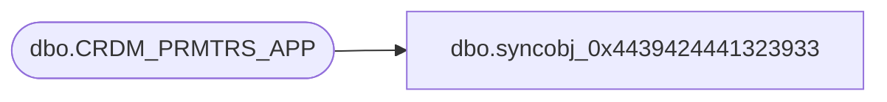

# dbo.syncobj_0x4439424441323933

**Database:** auditworks  
**Server:** bedrockdb01  

## Architecture Diagram



## Table Dependencies

| Referenced Table |
|---|
| dbo.CRDM_PRMTRS_APP |

## View Code

```sql
create view [dbo].[syncobj_0x4439424441323933]as select  [APP_ID],[PRMTR_GRP_CODE],[APP_NAME],[ACTV]  from  [dbo].[CRDM_PRMTRS_APP]  where HAS_PERMS_BY_NAME('[dbo].[CRDM_PRMTRS_APP]', 'OBJECT', 'SELECT')= 1
```

