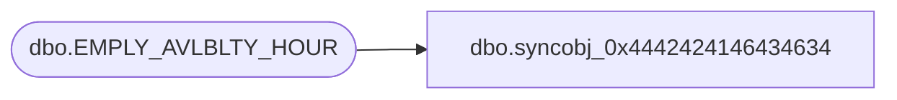

# dbo.syncobj_0x4442424146434634

**Database:** auditworks  
**Server:** bedrockdb01  

## Architecture Diagram



## Table Dependencies

| Referenced Table |
|---|
| dbo.EMPLY_AVLBLTY_HOUR |

## View Code

```sql
create view [dbo].[syncobj_0x4442424146434634]as select  [EMPLY_NUM],[EFCTV_DATE],[EXPRY_DATE],[HOUR_ID]  from  [dbo].[EMPLY_AVLBLTY_HOUR]  where HAS_PERMS_BY_NAME('[dbo].[EMPLY_AVLBLTY_HOUR]', 'OBJECT', 'SELECT')= 1
```

