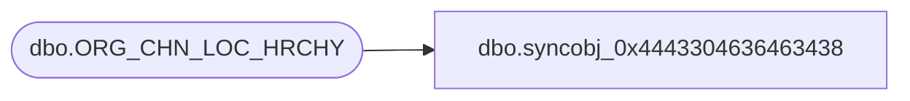

# dbo.syncobj_0x4443304636463438

**Database:** auditworks  
**Server:** bedrockdb01  

## Architecture Diagram



## Table Dependencies

| Referenced Table |
|---|
| dbo.ORG_CHN_LOC_HRCHY |

## View Code

```sql
create view [dbo].[syncobj_0x4443304636463438]as select  [HRCHY_ID],[HRCHY_DESC],[ACTV],[DFLT_GRP_ID],[SCRTY_USR_ID],[MTLY_EXCLSV],[MNDTRY_ASGNMNT]  from  [dbo].[ORG_CHN_LOC_HRCHY]  where HAS_PERMS_BY_NAME('[dbo].[ORG_CHN_LOC_HRCHY]', 'OBJECT', 'SELECT')= 1
```

