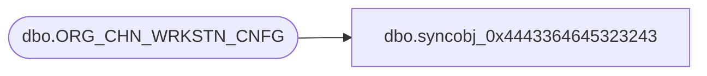

# dbo.syncobj_0x4443364645323243

**Database:** auditworks  
**Server:** bedrockdb01  

## Architecture Diagram



## Table Dependencies

| Referenced Table |
|---|
| dbo.ORG_CHN_WRKSTN_CNFG |

## View Code

```sql
create view [dbo].[syncobj_0x4443364645323243]as select  [WRKSTN_CNFG_CODE],[WRKSTN_CNFG_DESC],[WRKSTN_CNFG_SHRT_DESC],[TRAN_TRNSLT_VRSN_NUM],[PLNG_FILE_NAME],[ACTV],[RPRT_UNSD_WRKSTNS]  from  [dbo].[ORG_CHN_WRKSTN_CNFG]  where HAS_PERMS_BY_NAME('[dbo].[ORG_CHN_WRKSTN_CNFG]', 'OBJECT', 'SELECT')= 1
```

