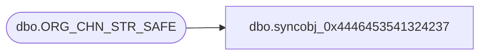

# dbo.syncobj_0x4446453541324237

**Database:** auditworks  
**Server:** bedrockdb01  

## Architecture Diagram



## Table Dependencies

| Referenced Table |
|---|
| dbo.ORG_CHN_STR_SAFE |

## View Code

```sql
create view [dbo].[syncobj_0x4446453541324237]as select  [SAFE_ID],[ORG_CHN_NUM],[SAFE_DESC],[SAFE_SHRT_DESC],[BLNC_AMT],[ACTV]  from  [dbo].[ORG_CHN_STR_SAFE]  where HAS_PERMS_BY_NAME('[dbo].[ORG_CHN_STR_SAFE]', 'OBJECT', 'SELECT')= 1
```

