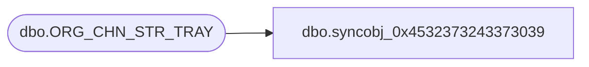

# dbo.syncobj_0x4532373243373039

**Database:** auditworks  
**Server:** bedrockdb01  

## Architecture Diagram



## Table Dependencies

| Referenced Table |
|---|
| dbo.ORG_CHN_STR_TRAY |

## View Code

```sql
create view [dbo].[syncobj_0x4532373243373039]as select  [TRAY_ID],[TRAY_NUM],[TRAY_DESC],[ORG_CHN_NUM],[MAX_ALWD_TNDR_AMT],[DFLT_OPEN_CASH_BLNC_AMT],[ACTV]  from  [dbo].[ORG_CHN_STR_TRAY]  where HAS_PERMS_BY_NAME('[dbo].[ORG_CHN_STR_TRAY]', 'OBJECT', 'SELECT')= 1
```

