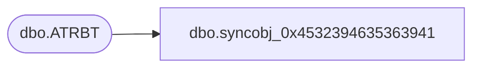

# dbo.syncobj_0x4532394635363941

**Database:** auditworks  
**Server:** bedrockdb01  

## Architecture Diagram



## Table Dependencies

| Referenced Table |
|---|
| dbo.ATRBT |

## View Code

```sql
create view [dbo].[syncobj_0x4532394635363941]as select  [ATRBT_CODE],[ATRBT_DESC],[IS_ACTV],[IS_XCLSV],[ATRBT_TYPE],[MNDTRY],[SYSTM_DFND]  from  [dbo].[ATRBT]  where HAS_PERMS_BY_NAME('[dbo].[ATRBT]', 'OBJECT', 'SELECT')= 1
```

