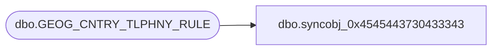

# dbo.syncobj_0x4545443730433343

**Database:** auditworks  
**Server:** bedrockdb01  

## Architecture Diagram



## Table Dependencies

| Referenced Table |
|---|
| dbo.GEOG_CNTRY_TLPHNY_RULE |

## View Code

```sql
create view [dbo].[syncobj_0x4545443730433343]as select  [TLPHNY_RULE_ID],[TLPHNY_RULE_DESC],[TLPHNY_RULE_SHRT_DESC],[TLPHNY_VLDTN],[TLPHNY_FRMTNG_INSTRCTNS],[CNTRY_CODE_ISO3]  from  [dbo].[GEOG_CNTRY_TLPHNY_RULE]  where HAS_PERMS_BY_NAME('[dbo].[GEOG_CNTRY_TLPHNY_RULE]', 'OBJECT', 'SELECT')= 1
```

