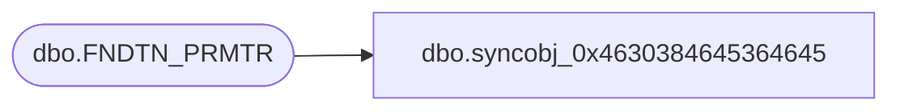

# dbo.syncobj_0x4630384645364645

**Database:** auditworks  
**Server:** bedrockdb01  

## Architecture Diagram



## Table Dependencies

| Referenced Table |
|---|
| dbo.FNDTN_PRMTR |

## View Code

```sql
create view [dbo].[syncobj_0x4630384645364645]as select  [PRMTR_KEY],[PRMTR_VAL],[PRMTR_LBL],[PRMTR_DESC],[MAX_VAL],[MIN_VAL],[DFLT_VAL],[DATA_TYPE],[PRMTR_MDFBL]  from  [dbo].[FNDTN_PRMTR]  where HAS_PERMS_BY_NAME('[dbo].[FNDTN_PRMTR]', 'OBJECT', 'SELECT')= 1
```

