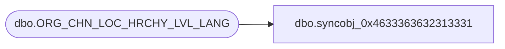

# dbo.syncobj_0x4633363632313331

**Database:** auditworks  
**Server:** bedrockdb01  

## Architecture Diagram



## Table Dependencies

| Referenced Table |
|---|
| dbo.ORG_CHN_LOC_HRCHY_LVL_LANG |

## View Code

```sql
create view [dbo].[syncobj_0x4633363632313331]as select  [HRCHY_LVL_ID],[LANG_ID],[HRCHY_LVL_DESC]  from  [dbo].[ORG_CHN_LOC_HRCHY_LVL_LANG]  where HAS_PERMS_BY_NAME('[dbo].[ORG_CHN_LOC_HRCHY_LVL_LANG]', 'OBJECT', 'SELECT')= 1
```

