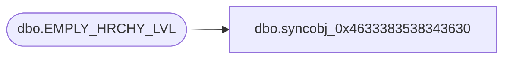

# dbo.syncobj_0x4633383538343630

**Database:** auditworks  
**Server:** bedrockdb01  

## Architecture Diagram



## Table Dependencies

| Referenced Table |
|---|
| dbo.EMPLY_HRCHY_LVL |

## View Code

```sql
create view [dbo].[syncobj_0x4633383538343630]as select  [HRCHY_LVL_ID],[HRCHY_LVL_DESC],[SEQ_NUM],[AFLTN_PRMTD],[HRCHY_ID],[PRNT_HRCHY_LVL_ID]  from  [dbo].[EMPLY_HRCHY_LVL]  where HAS_PERMS_BY_NAME('[dbo].[EMPLY_HRCHY_LVL]', 'OBJECT', 'SELECT')= 1
```

