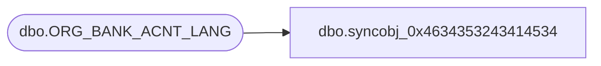

# dbo.syncobj_0x4634353243414534

**Database:** auditworks  
**Server:** bedrockdb01  

## Architecture Diagram



## Table Dependencies

| Referenced Table |
|---|
| dbo.ORG_BANK_ACNT_LANG |

## View Code

```sql
create view [dbo].[syncobj_0x4634353243414534]as select  [LANG_ID],[BANK_ACNT_ID],[BANK_ACNT_DESC]  from  [dbo].[ORG_BANK_ACNT_LANG]  where HAS_PERMS_BY_NAME('[dbo].[ORG_BANK_ACNT_LANG]', 'OBJECT', 'SELECT')= 1
```

