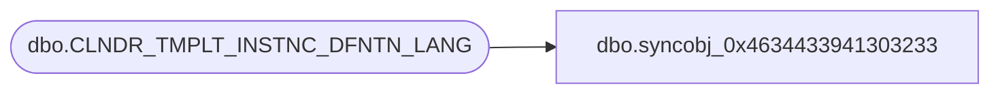

# dbo.syncobj_0x4634433941303233

**Database:** auditworks  
**Server:** bedrockdb01  

## Architecture Diagram



## Table Dependencies

| Referenced Table |
|---|
| dbo.CLNDR_TMPLT_INSTNC_DFNTN_LANG |

## View Code

```sql
create view [dbo].[syncobj_0x4634433941303233]as select  [LANG_ID],[CLNDR_TMPLT_ID],[CHLD_CLNDR_LVL_TYPE_ID],[PRNT_CLNDR_LVL_TYPE_ID],[CLNDR_TMPLT_INSTNC_SEQ],[LBL_TEXT]  from  [dbo].[CLNDR_TMPLT_INSTNC_DFNTN_LANG]  where HAS_PERMS_BY_NAME('[dbo].[CLNDR_TMPLT_INSTNC_DFNTN_LANG]', 'OBJECT', 'SELECT')= 1
```

