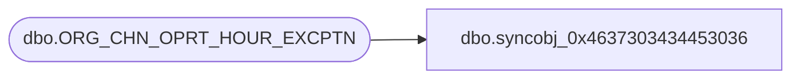

# dbo.syncobj_0x4637303434453036

**Database:** auditworks  
**Server:** bedrockdb01  

## Architecture Diagram



## Table Dependencies

| Referenced Table |
|---|
| dbo.ORG_CHN_OPRT_HOUR_EXCPTN |

## View Code

```sql
create view [dbo].[syncobj_0x4637303434453036]as select  [ORG_CHN_NUM],[EXCPTN_DATE],[START_TIME],[END_TIME],[CLSD],[RSN_ID],[FDN_CSTMZTN_DATA]  from  [dbo].[ORG_CHN_OPRT_HOUR_EXCPTN]  where HAS_PERMS_BY_NAME('[dbo].[ORG_CHN_OPRT_HOUR_EXCPTN]', 'OBJECT', 'SELECT')= 1
```

