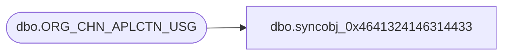

# dbo.syncobj_0x4641324146314433

**Database:** auditworks  
**Server:** bedrockdb01  

## Architecture Diagram



## Table Dependencies

| Referenced Table |
|---|
| dbo.ORG_CHN_APLCTN_USG |

## View Code

```sql
create view [dbo].[syncobj_0x4641324146314433]as select  [ORG_CHN_NUM],[APLCTN_ID],[VLDTY],[SRVR_INSTNC_ID]  from  [dbo].[ORG_CHN_APLCTN_USG]  where HAS_PERMS_BY_NAME('[dbo].[ORG_CHN_APLCTN_USG]', 'OBJECT', 'SELECT')= 1
```

