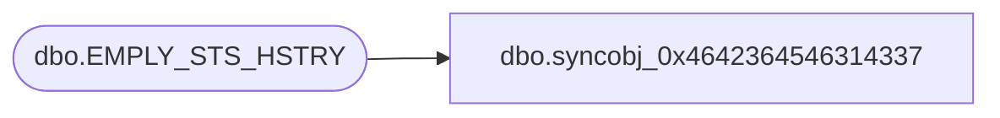

# dbo.syncobj_0x4642364546314337

**Database:** auditworks  
**Server:** bedrockdb01  

## Architecture Diagram



## Table Dependencies

| Referenced Table |
|---|
| dbo.EMPLY_STS_HSTRY |

## View Code

```sql
create view [dbo].[syncobj_0x4642364546314337]as select  [EMPLY_NUM],[EFCTV_DATE],[EMPLY_STS_CODE],[EXPRTN_DATE],[FDN_CSTMZTN_DATA]  from  [dbo].[EMPLY_STS_HSTRY]  where HAS_PERMS_BY_NAME('[dbo].[EMPLY_STS_HSTRY]', 'OBJECT', 'SELECT')= 1
```

