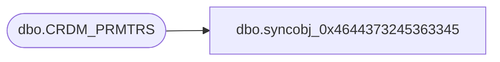

# dbo.syncobj_0x4644373245363345

**Database:** auditworks  
**Server:** bedrockdb01  

## Architecture Diagram



## Table Dependencies

| Referenced Table |
|---|
| dbo.CRDM_PRMTRS |

## View Code

```sql
create view [dbo].[syncobj_0x4644373245363345]as select  [PRMTR_NAME],[PRMTR_DESC],[PRMTR_CMNT],[PRMTR_DATA_TYPE],[PRMTR_VAL],[PRMTR_VAL_BIN],[PRMTR_GRP_CODE],[PRMTR_VAL_FRM_RNG],[PRMTR_VAL_TO_RNG],[DRP_DWN_QRY],[SEQ_NUM]  from  [dbo].[CRDM_PRMTRS]  where HAS_PERMS_BY_NAME('[dbo].[CRDM_PRMTRS]', 'OBJECT', 'SELECT')= 1
```

