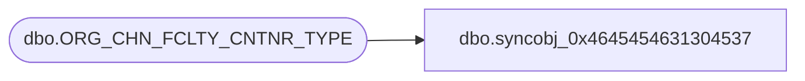

# dbo.syncobj_0x4645454631304537

**Database:** auditworks  
**Server:** bedrockdb01  

## Architecture Diagram



## Table Dependencies

| Referenced Table |
|---|
| dbo.ORG_CHN_FCLTY_CNTNR_TYPE |

## View Code

```sql
create view [dbo].[syncobj_0x4645454631304537]as select  [CNTNR_TYPE_CODE],[CNTNR_TYPE_DESC],[CNTNR_TYPE_SHRT_DESC],[RSTRCTD_TO_FCLTY],[SYS_CODE]  from  [dbo].[ORG_CHN_FCLTY_CNTNR_TYPE]  where HAS_PERMS_BY_NAME('[dbo].[ORG_CHN_FCLTY_CNTNR_TYPE]', 'OBJECT', 'SELECT')= 1
```

