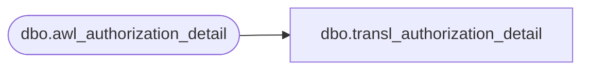

# dbo.transl_authorization_detail

**Database:** auditworks  
**Server:** bedrockdb01  

## Architecture Diagram



## Table Dependencies

| Referenced Table |
|---|
| dbo.awl_authorization_detail |

## View Code

```sql
CREATE VIEW dbo.transl_authorization_detail AS
   SELECT store_no,
          register_no,
          entry_date_time,
          transaction_series,
          transaction_no,
          line_id,
          customer_signature_obtained,
          authorization_no,
          expiry_date,
          swipe_indicator,
          approval_message,
          license_no,
          pos_state_code,
          other_id_type,
          other_id,
          card_type,
          deferred_billing_date,
          deferred_billing_plan,
          offline_flag,
          row_sequence_no,
          transaction_id 
     FROM auditworks_work.dbo.awl_authorization_detail
```

