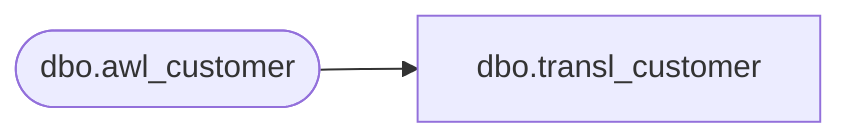

# dbo.transl_customer

**Database:** auditworks  
**Server:** bedrockdb01  

## Architecture Diagram



## Table Dependencies

| Referenced Table |
|---|
| dbo.awl_customer |

## View Code

```sql
CREATE VIEW dbo.transl_customer AS
   SELECT store_no,
          register_no,
          entry_date_time,
          transaction_series,
          transaction_no,
          line_id,
          customer_role,
          title,
          first_name,
          last_name,
          address_1,
          address_2,
          city,
          county,
          state,
          country,
          post_code,
          telephone_no1,
          telephone_no2,
          customer_no,
          row_sequence_no,
          pos_tax_jurisdiction_code,
          fax,
          email_address,
          more_info_flag,
          customer_sufficient 
     FROM auditworks_work.dbo.awl_customer
```

